  

  
  

---

I build AI-enabled automation and secure systems-integration infrastructure that connects
financial, operational, and field-service platforms — the plumbing that lets accounting
systems, CRMs, e-commerce storefronts, and field-service tools behave as one.

- **Multi-tenant integration services** — OAuth 2.0 authorization flows, webhook ingestion and
  signature verification, encrypted credential storage, and per-tenant isolation.
- **AI agent workspaces** — multi-agent orchestration with LangChain and LangGraph, with
  LLM output passed through validation before it reaches a system of record.
- **Operations and field-service platforms** — job tracking, document capture, and reporting
  for teams working away from a desk.
- **Commerce and accounting extensions** — storefront and back-office features built directly
  on the QuickBooks, Shopify, and Airtable platforms.

Before moving into full-time engineering I spent six years teaching Information Systems at
university level in Brazil — 23 undergraduate courses and 1,620 classroom hours in programming,
data structures, databases, secure software development, and computer networks.

### Certifications

  
  
  

### Stack

### Education

**B.Sc. in Information Systems** — Faculdade Anhanguera de Negócios e Tecnologias da Informação,
Brasília, Brazil · 2013–2018

---

### Contributions

<picture>
  <source media="(prefers-color-scheme: dark)"  srcset="https://raw.githubusercontent.com/guilannes2/guilannes2/output/github-snake-dark.svg">
  <source media="(prefers-color-scheme: light)" srcset="https://raw.githubusercontent.com/guilannes2/guilannes2/output/github-snake.svg">
  
</picture>

Client and product work lives in private repositories, so the contribution graph above is the
public record of it. Available on request for anyone evaluating my work.

<!-- profile readme -->
